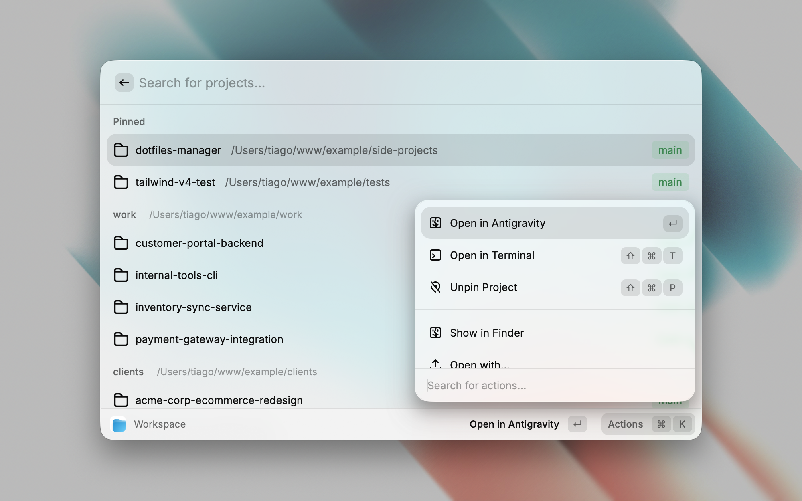
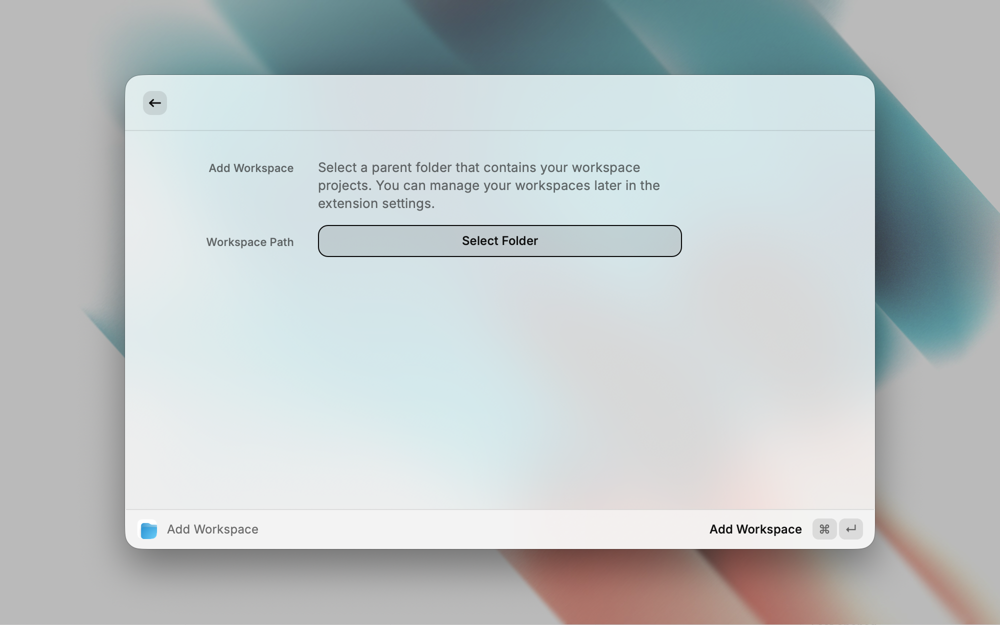

  

# Workspace

 

Manage and access all your development projects with ease.

Workspace is a Raycast extension that streamlines your workflow by providing a central hub for all your projects and folders across multiple parent directories.

> [!TIP]
> **Not just for developers!** While it's perfect for code, Workspace can manage any project or folder structure. You can configure any application to open specific workspaces—use it for design assets, writing projects, or even administrative folders.

## Installation

- **Recommended**: Install from the [Raycast Store](https://www.raycast.com/) once published.
- **From source**:
  1. Clone this repository.
  2. Open Raycast → Extensions → Add Extension → select the cloned folder.

## Key Features

- **Centralized access**: View all projects within your workspace folders in one unified list.
- **Smart project opening**: Open projects instantly in your default editor, with optional per-workspace application overrides.
- **Git status at a glance**: See branch names and pending changes (pull/push) without leaving Raycast.
- **Pin your favorites**: Keep your most-used projects at the top for instant access.
- **Full management**: Add, remove, and reorganize workspace folders directly in the extension.

## Screenshots

> _The main Workspace command showing pinned projects, Git status badges, and quick search._

> _Adding, removing, and reordering workspace folders._
> _Example of per-workspace application override in action._

## Getting Started

1. **Add workspace folders**: Run the `Manage Workspaces` command to select parent folders containing your projects.
2. **Set your editor**: Configure your default application in `Workspace Settings` (defaults to your preferred code editor).
3. **Open a project**: Use the `Workspace` command to search and open any project instantly.

## Commands

- **Workspace**: Search and open your projects.
- **Manage Workspaces**: View, reorganize, add, or remove project root folders.
- **Workspace Settings**: Configure the default app and manage per-workspace application overrides.

## Creator's Note

I use Raycast every day and keep the `Workspace` command in my **Favorites**. My personal workflow for maximum speed:

1. Press `⌘ + Space` to open Raycast.
2. Press `⌘ + 2` (it's second in my favorites).
3. Type the project name or select one of my **Pinned** projects.

It's the fastest way I've found to switch between context-heavy projects.

## Contributing

Contributions are welcome! If you have suggestions or find bugs, feel free to open an issue or submit a pull request on GitHub.
