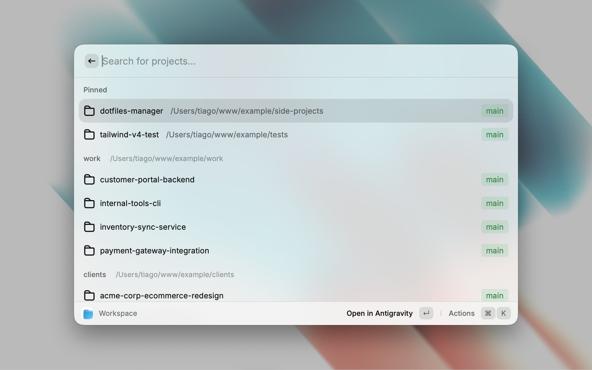
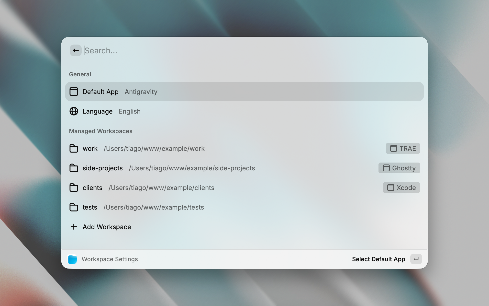

  

# Workspace

Manage and access all your projects and folders from one place.

Workspace is a Raycast extension that gives you a central hub for all your projects across multiple directories.

> [!TIP]
> **Not just for developers!** Perfect for code, design assets, writing, or any folder-based workflows.

## Installation

1. Clone this repository.
2. Open Raycast → Extensions → Add Extension → select the cloned folder.

> **Note**: Currently available only via manual installation from source.

## Key Features

- Blazing-fast fzf-style fuzzy search
- Unified list of all projects from your configured workspace folders
- Instant open in your default (or per-workspace) application
- Git status: current branch + pending changes
- Pin favorite projects
- Add, remove, and reorder workspace folders

## Screenshots

> Main Workspace command with pinned projects, Git status, and fast search.

> Adding, removing, and reordering workspace folders + per-workspace app overrides.

## Getting Started

1. Run **Manage Workspaces** to add your project root folders.
2. Configure your default application in **Workspace Settings**.
3. Use the **Workspace** command to search and open projects instantly.

## Commands

- **Workspace** – Search and open projects
- **Manage Workspaces** – Add/remove/reorder workspace folders
- **Workspace Settings** – Default app + per-workspace overrides

## Creator's Note

I keep the `Workspace` command in my Raycast Favorites (`⌘ + 2`).  
Fastest workflow: `⌘ + Space` → `⌘ + 2` → type project name or pick a pinned one.

## Contributing

Contributions welcome! Open an issue or submit a pull request on GitHub.
